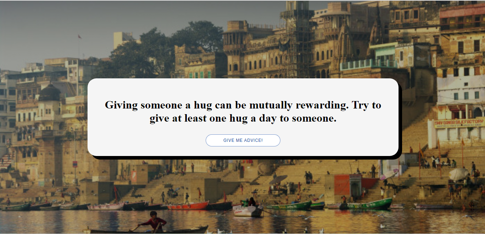

# Random Advice

 <!-- If applicable -->

Random Advice is a web-based project aimed at providing users with random pieces of advice, tips, and wisdom on a variety of topics. It's designed to offer a lighthearted and serendipitous experience, where users can receive advice that might range from practical to humorous, and from profound to whimsical. The project aims to entertain, inspire, and sometimes even make users reflect on the randomness of life.

## Contributing

Contributions are welcome! If you'd like to contribute to Concierge.AI, follow these steps:

1. Fork the repository.
2. Create a new branch for your feature: `git checkout -b feature-name`
3. Make your changes and commit them: `git commit -am 'Add new feature'`
4. Push your changes to your fork: `git push origin feature-name`
5. Submit a pull request detailing your changes.

Please ensure your code follows the project's coding standards and includes appropriate documentation.

## Available Scripts

In the project directory, you can run:

### `npm start`

Runs the app in the development mode.\
Open [http://localhost:3000](http://localhost:3000) to view it in your browser.

The page will reload when you make changes.\
You may also see any lint errors in the console.

### `npm test`

Launches the test runner in the interactive watch mode.\
See the section about [running tests](https://facebook.github.io/create-react-app/docs/running-tests) for more information.

### `npm run build`

Builds the app for production to the `build` folder.\
It correctly bundles React in production mode and optimizes the build for the best performance.

The build is minified and the filenames include the hashes.\
Your app is ready to be deployed!

See the section about [deployment](https://facebook.github.io/create-react-app/docs/deployment) for more information.

This section has moved here: [https://facebook.github.io/create-react-app/docs/deployment](https://facebook.github.io/create-react-app/docs/deployment)

### `npm run build` fails to minify

This section has moved here: [https://facebook.github.io/create-react-app/docs/troubleshooting#npm-run-build-fails-to-minify](https://facebook.github.io/create-react-app/docs/troubleshooting#npm-run-build-fails-to-minify)
